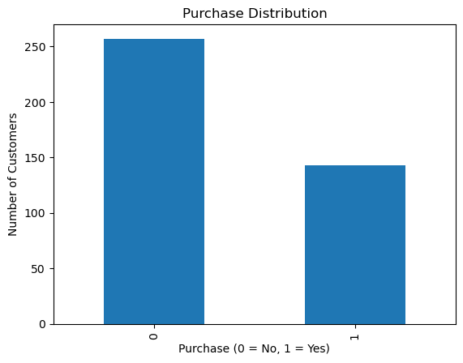
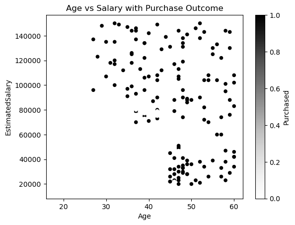

# Customer Purchase Prediction using KNN and Naive Bayes

## 📌 Project Overview
This project aims to predict whether a customer will purchase a product based on
demographic features such as **Age** and **Estimated Salary**.
The project demonstrates a complete machine learning workflow suitable for
**Data Analyst / Junior ML roles**, focusing on clarity, correctness, and business interpretation.

---

## 📊 Dataset
- **Dataset Name:** Social Network Ads
- **Number of Records:** 400
- **Features:**
  - Age
  - Estimated Salary
- **Target Variable:**
  - Purchased (0 = Not Purchased, 1 = Purchased)
- The dataset is clean with **no missing values** and contains only numerical features.

---

## 🛠️ Tools & Technologies
- Python  
- Pandas  
- NumPy  
- Matplotlib  
- Scikit-learn  

---

## 🔍 Exploratory Data Analysis (EDA)
Exploratory analysis was performed to understand customer behavior and feature distributions.

### Purchase Distribution

**Insight:**  
Most customers did not purchase the product, but the dataset is not highly imbalanced,
making it suitable for classification models.

---

### Age Distribution

**Insight:**  
Most customers fall into the young to middle-aged group, indicating age may influence
purchase decisions.

---

### Estimated Salary Distribution

**Insight:**  
Estimated salary values are widely distributed, making salary a strong predictive feature.

---

### Age vs Estimated Salary

**Insight:**  
Customers with higher age and higher estimated salary show a higher likelihood of purchasing,
making these features suitable for predictive modeling.

---

## ⚙️ Data Preprocessing
- Selected relevant features (Age, Estimated Salary)
- Performed train-test split
- Applied feature scaling using **StandardScaler** to ensure fair distance calculations
  for KNN

---

## 🤖 Models Implemented

### 1️⃣ K-Nearest Neighbors (KNN)
- Distance-based classification algorithm
- The value of **k = 4** was selected after experimentation
- **Accuracy:** ~88%

### 2️⃣ Naive Bayes
- Used **Gaussian Naive Bayes** for continuous features
- Simple and fast probabilistic classifier
- **Accuracy:** ~83%

---

## 📈 Model Evaluation
- Evaluated models using:
  - Confusion Matrix
  - Accuracy Score
- KNN outperformed Naive Bayes by producing fewer false negatives,
  which is important for identifying potential buyers.

---

## 📌 Conclusion
Both models performed well on the dataset, demonstrating effective classification
of customer purchase behavior.
KNN achieved better performance compared to Naive Bayes, making it more suitable
for this problem.
The project highlights a clear, reproducible, and business-focused machine learning workflow.

---

## 📂 Project Structure
